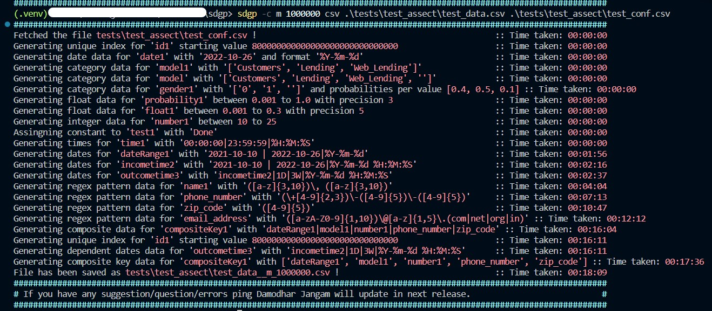

## Utilization [Synthetic data generator plus]() Project

[](https://github.com/damodhar918/sdgp/actions/workflows/python-app.yml) [](https://codecov.io/github/damodhar918/sdgp) [](https://github.com/damodhar918/sdgp/actions/workflows/unittest.yml)

For questions on this package contact the package Developer Damodhar Jangam at <damodhar918@outlook.com>

## Overview

This project [Synthetic data generator plus]() is a python script that generates mock data based on given configurations. It can also edit and scale existing data to create high volume data. It is useful for testing and prototyping purposes.

## Features

- Generate mock data for different types of configuration items
- Edit the mock data and generate mock data for different types of configuration items
- Configuration rules include generating unique indices, fixed or random dates/times, categorical values, float values within a range, integer values within a range, or constant values.
- Generate high volume data
- Save a DataFrame in CSV and Parquet file formats
- Futher can ingest into SQL server, HDFS, Hive, HBase, Kafka, etc.

## Package Installation

### Install on a Local Machine (optional)

Go through the following sequence:

- Clone repo
- Create a virtual environment and install the package

```bash
PS > python -m venv .venv
PS > .\.venv\Scripts\activate
PS > pip install -r requirements.txt
PS > python setup.py install
# You can utilize the package in this case by invoking sdgp.
PS > sdgp -h
# Before proceeding, please review the usage section.
PS > sdgp -c m 1000000 csv test test_conf.csv
PS > sdgp -c e 1000000 parquet test test_conf.csv
PS > deactivate # when you need exit
```

### Install on a edge node (optional)

Go through the following sequence:

- Clone repo
- Create a virtual environment and install the package

```bash
$ python3 -m venv .venv
$ source .venv/bin/activate
$ pip install -r requirements.txt
$ python setup.py install
# You can utilize the package in this case by invoking sdgp.
$ sdgp -h
# Before proceeding, please review the usage section.
$ sdgp -c m 1000000 csv test test_conf.csv
$ sdgp -c e 1000000 parquet test test_conf.csv
$ deactivate # when you need exit
```

You are nowready to proceed, as the package `Synthetic data generator plus` has been installed and is now available for utilization within your virtual environment.

## Usage

To run the script, you need to provide some arguments:

- `-c` or `--choice`: The type of function to select. `m` for mock data, `e` for edit mock data, `g` for generate high volume data.
- `volume`: The size. An integer value that specifies how many rows/records to generate mock data. Recommended minimum value more than 1000.
- `format`: The type of format to save the mock data. `csv` for CSV format, `parquet` for Parquet format.
- `csv_file`: The CSV file name. A string value that specifies the name of the CSV file to read if there or to write output.
- `conf_csv_file`: The configuration CSV file name. A string value that specifies the name of the configuration CSV file to read. This argument is required if mode is `e` or `g`.
Example configuration file:

| name          | type               | values                                                  |
| ------------- | ------------------ | ------------------------------------------------------- |
| id1           | uniqueIndex        | 800000000                                               |
| date1         | date               | 2022-10-26 \|%Y-%m-%d                                   |
| time1         | time               | 00:00:00\|23:59:59                                      |
| dateRange1    | dateRange          | 2021-10-10 \| 2022-10-26 \|%Y-%m-%d                     |
| incometime2   | dateRange          | 2021-10-10 \| 2022-10-26 \|%Y-%m-%d %H:%M:%S            |
| outcometime3  | dependentDateRange | incometime2\|1D\|3W\|%Y-%m-%d %H:%M:%S                  |
| model1        | category           | Customers\|Lending\|Web_Lending                         |
| model         | category           | Customers\|Lending\|Web_Lending \|                      |
| null1         | category           | \|                      |
| gender1       | category           | 0\|1\|~0.4\|0.5\|0.1                                    |
| probability1  | floatRange         | 0.001\|1\|3                                             |
| float1        | floatRange         | 0.001\|0.3\|5                                           |
| number1       | intRange           | 10\|25                                                  |
| test1         | constant           | Done                                                    |
| name1         | regexPattern       | ([a-z]{3,10})\, ([a-z]{3,10})                           |
| phone_number  | regexPattern       | (\+[4-9]{2,3})\-([4-9]{5})\-([4-9]{5})                  |
| zip_code      | regexPattern       | ([4-9]{5})                                              |
| email_address | regexPattern       | ([a-zA-Z0-9]{1,10})\@[a-z]{1,5}\.(com\|net\|org\|in)    |
| compositeKey  | composite          | dateRange1 \| model1 \|number1 \|phone_number\|zip_code |

```bash
name,type,values
id1,uniqueIndex,800000000000000000000000000000
date1,date,2022-10-26|%Y-%m-%d
time1,time,00:00:00|23:59:59|%H:%M:%S
dateRange1,dateRange,2021-10-10 | 2022-10-26|%Y-%m-%d
incometime2,dateRange,2021-10-10 | 2022-10-26|%Y-%m-%d %H:%M:%S
outcometime3,dependentDateRange,incometime2|1D|3W|%Y-%m-%d %H:%M:%S
model1,category,Customers|Lending|Web_Lending
model,category,Customers|Lending|Web_Lending|
null1,category,
gender1,category,0|1|~0.4|0.5|0.1
probability1,floatRange,0.001|1|3
float1,floatRange,0.001|0.3|5
number1,intRange,10|25
test1,constant,Done
name1,regexPattern,"([a-z]{3,10})\, ([a-z]{3,10})"
phone_number,regexPattern,"(\+[4-9]{2,3})\-([4-9]{5})\-([4-9]{5})"
zip_code,regexPattern,([4-9]{5})
email_address,regexPattern,"([a-zA-Z0-9]{1,10})\@[a-z]{1,5}\.(com|net|org|in)"
compositeKey1,composite,dateRange1|model1|number1|phone_number|zip_code
```

Explanation of data patterns as per defined in the configuration file :

- `uniqueIndex`: This indicates that the `id1` column should contain unique and sequential values,here it's starting from `800000000000000000000000000000`.
- `date`: This indicates that the `date1` column should contain a fixed date value (`2022-10-26`) for all rows. `%Y-%m-%d` format is used.
- `time`: This indicates that the `time1` column should contain random time values between `00:00:00` and `23:59:59` here you can pass reqired format like `%H:%M:%S`.
- `dateRange`: This indicates that the `dateRange1` and `incometime2` columns should contain random date values within the range from `2021-10-10` to `2022-10-26`. The format of the dates in `incometime2` also includes `%Y-%m-%d %H:%M:%S`. For other formats reference given below.
- `dependentDateRange`: This indicates that the `outcometime3` column should contain random duration values within the range from `1D` to `3W` in addition to the `incometime2`.Here `1D` means 1 day and `3W` means 3 weeks. Other compatable inputs are `10S` means 10 seconds, `5m` means 5 minutes, `2h` means 2 hours, `3d` means 3 days, `4W` means 4 weeks. The format of the dates in `outcometime3` also includes`%Y-%m-%d %H:%M:%S`. format reference given below.
- `category`: This indicates that the `model1` column should contain random categorical values chosen from the options "Customers", "Lending", and "Web_Lending".
**Note 1**: If you want to add some empty value in the column then add `|` at the end of the values as in `model`.
**Note 2**: If you want categorical values with probilities then add `~` at the end of the values as in `gender1` input `0|1|~0.4|0.5|0.1`. here ~ is seperater between categorical values and probilities ["0", "1",""] ~ ["0.4", "0.5", "0.1"].
**Note 3**: If you want full null/empty values in the column then add `|` at the end of the values as in `null1` column.
- `floatRange`: This indicates that the `probability1` and `float` columns should contain random float values within a given range. The range for `probability1` is from `0.001` to `1`, with a precision of 3 decimal places. The range for `float` is from `0.001` to `0.3`, with a precision of 5 decimal places.
- `intRange`: This indicates that the `number1` column should contain random integer values within the range from 10 to 25.
- `constant`: This indicates that the `test1` column should contain a constant value (`Done`) for all rows.
- `regexPattern`: This indicates that the `name1` column should contain a fixed pattren range value (`([a-z]{3,10})\, ([a-z]{3,10})`) for all records. The`phone_number` column should contain a fixed length phone number value (`(\+[4-9]{2,3})\-([1-9]{5})\-([1-9]{5})`) for all records. The `zip_code` column should contain a fixed length zip code value (`([4-9]{5})`) for all records. `email_address` column should contain a fixed length email address value (`([a-zA-Z0-9]{1,10})\@[a-z]{1,5}\.(com|net|org|in)`) for all records. For more regex pattren check [here](https://docs.python.org/3/howto/regex.html#simple-patterns) and play around with it.
**Note:** regexPattern takes long time to generate data.
- `composite`: This indicates that the `compositeKey1` column should contain sha256 hashed value from these combinations: `dateRange1|model1|number1|phone_number|zip_code`

Each row in this CSV file defines a rule for generating or handling data in a specific column of another dataset. The rules include generating unique indices, fixed or random dates/times, categorical values, float values within a range, integer values within a range, or constant values.

datetime formats you can use in the script:

- `%a`: Weekday as locale’s abbreviated name. Example: Mon
- `%A`: Weekday as locale’s full name. Example: Monday
- `%w`: Weekday as a decimal number, where 0 is Sunday and 6 is Saturday. Example: 1
- `%d`: Day of the month as a zero-padded decimal number. Example: 30
- `%b`: Month as locale’s abbreviated name. Example: Sep
- `%B`: Month as locale’s full name. Example: September
- `%m`: Month as a zero-padded decimal number. Example: 09
- `%y`: Year without century as a zero-padded decimal number. Example: 99
- `%Y`: Year with century as a decimal number. Example: 2013
- `%H`: Hour (24-hour clock) as a zero-padded decimal number. Example: 07
- `%I`: Hour (12-hour clock) as a zero-padded decimal number. Example: 07
- `%p`: Locale’s equivalent of either AM or PM. Example: AM
- `%M`: Minute as a zero-padded decimal number. Example: 06
- `%S`: Second as a zero-padded decimal number. Example: 05

To run the script, use the following command:

```csv
sdgp -c <choice> <volume> <format> <csv_file> <conf_csv_file>

positional arguments:
  volume                The size. An integer value that specifies how many rows to generate mock data. Recommended
                        minimum value is more than volume size or more than 1000.
  {csv,parquet}         The type of format to save the mock data. csv for CSV format, parquet for Parquet format.
  csv_file              The CSV file name. A string value that specifies the name of the CSV file to read or write.
  conf_csv_file         The configuration CSV file name. A string value that specifies the name of the configuration
                        CSV file to read. This argument is required if mode is e or g.
options:
  -h, --help            show this help message and exit
  -c {m,e,g}, --choice {m,e,g}
                        The type of function to select. m for mock data, e for edit mock data, g for generate high
                        volume data.
```

For example:

```bash
sdgp -c m 50000 csv mock_table conf.csv # Generate 50000 rows of mock data and save as mock_table_50000.csv
sdgp -c e 100000 parquet edit_table.csv conf.csv # Along with given data can edit with conf.csv, generate 100000 recrds and save as edit_table_100000.parquet\n
sdgp -c g 1000000 csv scale.csv # Generate 1000000 rows of mock data by scaling existing data and save as scale_1000000.csv
```

Sample output for `sdgp -c m 1000000 csv test .\test_conf.csv`:



```bash
id1,date1,model1,model,gender1,probability1,float1,number1,test1,time1,dateRange1,incometime2,outcometime3,name1,phone_number,zip_code,email_address,compositeKey1
800000000000000000000000022022,2022-10-26,Lending,,1,0.526,0.01349,18,Done,09:17:27,2021-12-21,2021-10-11 19:45:49,2021-10-29 15:22:51,"xfdqsmj, pfnzgqd",+69-68479-47968,45568,S@euly.in,5291fed2490313181144993e6f9d0e478a774cbe
800000000000000000000000069854,2022-10-26,Lending,Web_Lending,1,0.466,0.13702,23,Done,13:06:09,2022-06-16,2022-05-06 05:33:04,2022-05-15 23:17:00,"spjcnaumo, fmxd",+769-58564-59786,74648,6HzAItG@rcfsb.com,553d8e0a445569f8c329c4f2cad5bd0a217e2cf8
800000000000000000000000052417,2022-10-26,Lending,Customers,1,0.474,0.07092,15,Done,13:27:22,2022-05-12,2022-06-09 00:01:55,2022-06-20 04:30:03,"wnzebd, xuhqai",+99-88586-45856,49977,c0@u.in,65d22a12c4c95d2d14615f9d5b4c6582cd60c45f
800000000000000000000000068698,2022-10-26,Customers,Web_Lending,0,0.012,0.12498,23,Done,00:19:00,2022-09-15,2022-04-25 08:29:39,2022-05-14 14:29:06,"kccxqzujf, aqitzbuj",+47-86496-46488,75598,1h4xIF@dx.in,f2c1cd5e87cc1a5ed0cf800bcb7228c3c4f621cb
```


[Samlpe output](./tests/test_assect/test_data.csv)

## License

This project is licensed under the MIT License - see the [LICENSE](./LICENSE) file for details.

## Acknowledgments

If you have any questions, feedback, or suggestions, please feel free to contact me at <damodhar918@outlook.com>. You can also open an issue or submit a pull request on GitHub if you want to contribute to this project.
I hope you find this project useful and interesting. Thank you for reading! 😊
